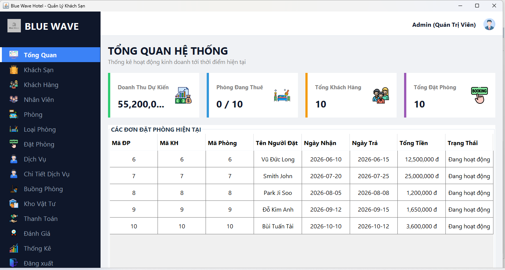
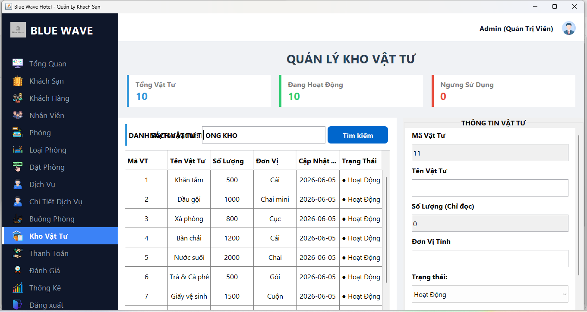
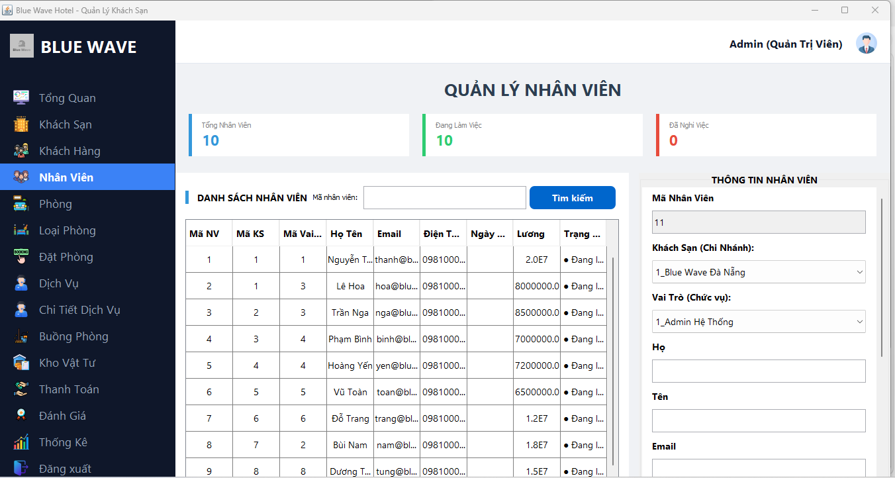
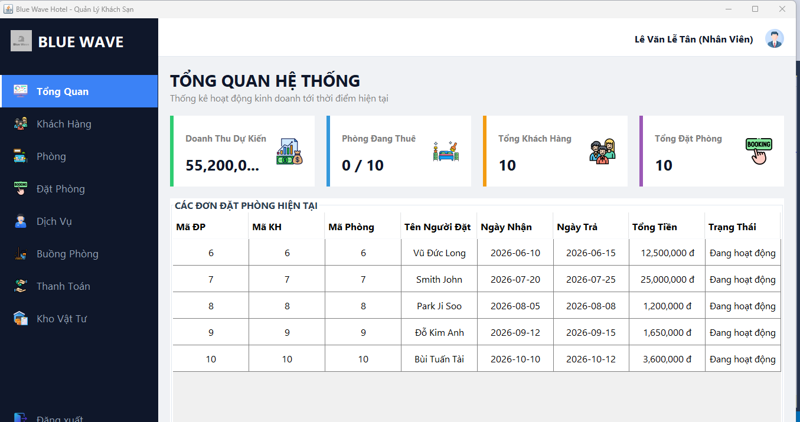
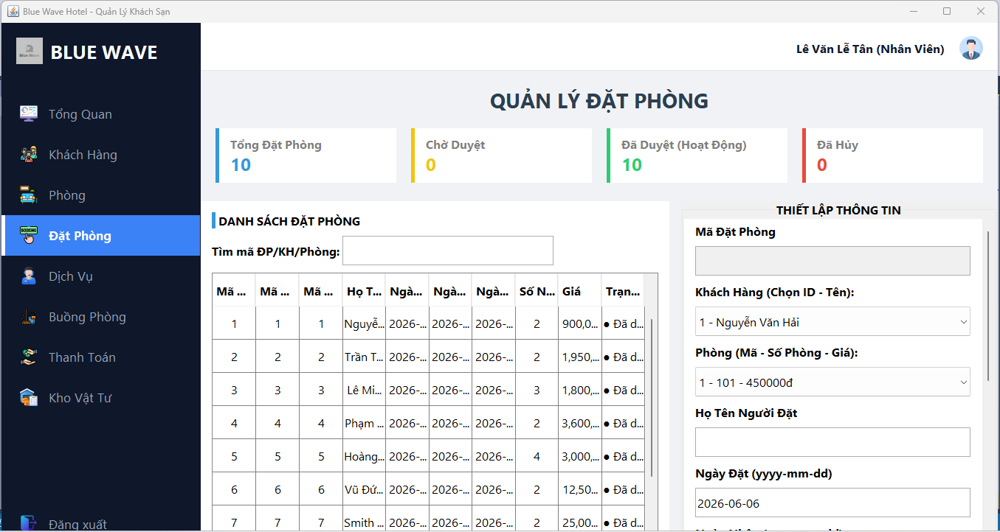
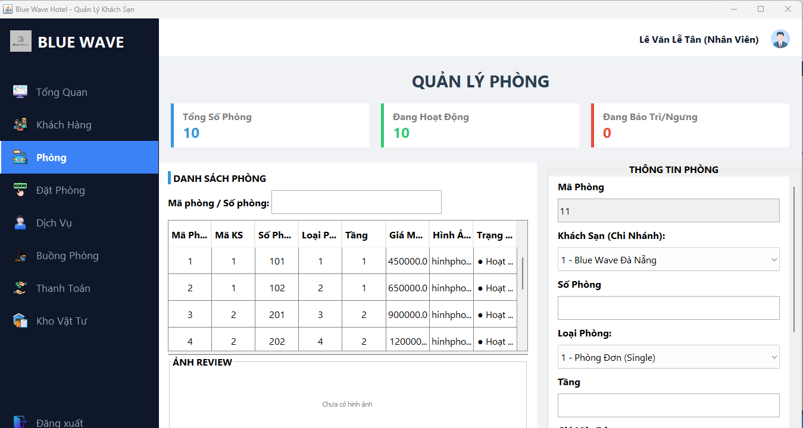
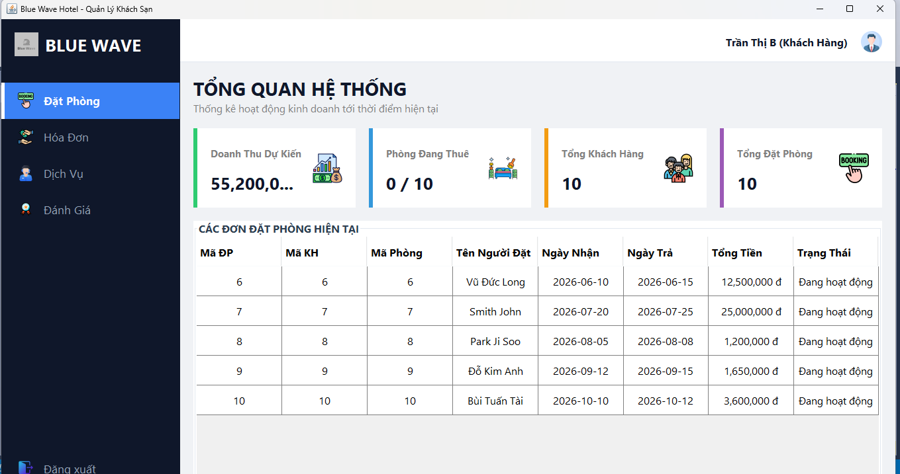
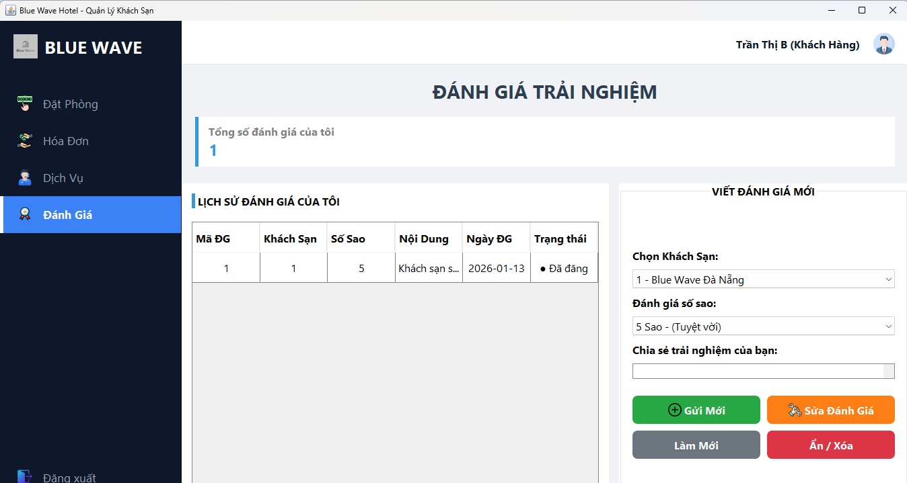
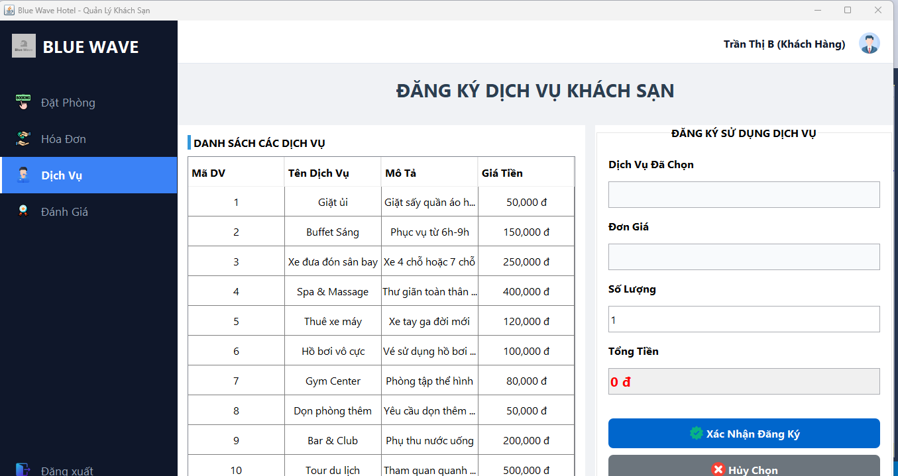

# Ứng dụng Quản lý Khách sạn trên Desktop

Một ứng dụng desktop để quản lý hoạt động khách sạn.  
Dự án này được phát triển như một bài tập học thuật nhằm thực hành **Fullstack Development** với **Java** và **Java Swing**.

---

## 📌 Thông tin Dự án
- **Quy mô nhóm:** 4  
- **Vai trò:** Fullstack Developer  
- **Thời gian:** Tháng 12/2025 – Tháng 3/2026  
- **Ngôn ngữ/Frameworks:** Java, Java Swing  

---

## 📌 Tổng quan
Hệ thống được thiết kế để quản lý các hoạt động khách sạn bao gồm đặt phòng, dữ liệu khách hàng và các tác vụ quản trị.  
Ứng dụng tuân theo thiết kế dựa trên UML và triển khai **Kiến trúc 3 lớp**.

---

## 📌 Tính năng
- <mark>Xác thực</mark> (đăng nhập/đăng ký)
- <mark>Kiểm soát truy cập theo vai trò</mark> (Quản trị viên, Nhân viên, Khách hàng)
- <mark>Bảng điều khiển Quản trị viên</mark> để quản lý phòng, nhân viên và khách hàng
- <mark>Bảng điều khiển Nhân viên</mark> để quản lý phòng và hệ thống
- <mark>Thống kê</mark> và báo cáo
- <mark>Bảng điều khiển Khách hàng</mark> để đặt phòng, gửi phản hồi 
---

## 📌 Thiết kế Hệ thống
- Thiết kế <mark>Sơ đồ ERD</mark> để mô hình hóa các thực thể và quan hệ trong hệ thống  
- Triển khai <mark>Kiến trúc 3 lớp</mark>  
- Cơ sở dữ liệu xây dựng trên <mark>Microsoft SQL Server</mark>  

---

## 📌 Cách chạy
1. Clone repository:
   ```bash
   git clone https://github.com/DuyKhoiCoder30062004/DoAn_Java_HK2_2026_World_Cup.git
2. Mở dự án trong NetBeans hoặc IntelliJ IDEA.
3. Cấu hình chuỗi kết nối SQL Server.
4. Biên dịch và chạy file MainDashboard.java trong folder: com.quanlykhachsanGUI.Main 

## 📌 Ảnh chụp màn hình
## Quyền Admin
<div align="center">



</div>
## Quyền Nhân viên
<div align="center">



</div>
## Quyền Khách hàng
<div align="center">



</div>

## 📌 Đóng góp
Dự án được phát triển bởi nhóm 4 sinh viên trong khuôn khổ môn học Java.

## 📌 Giấy phép
Dự án này chỉ phục vụ mục đích học tập.
